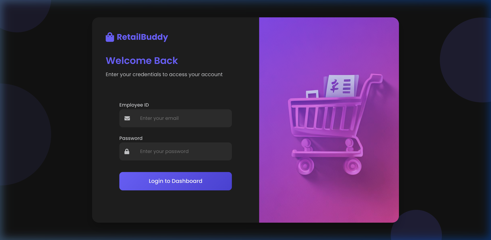
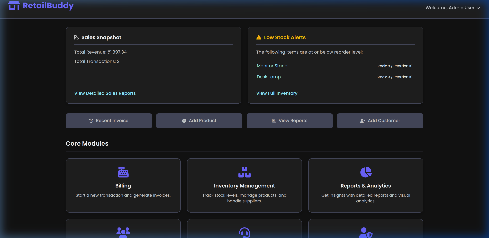
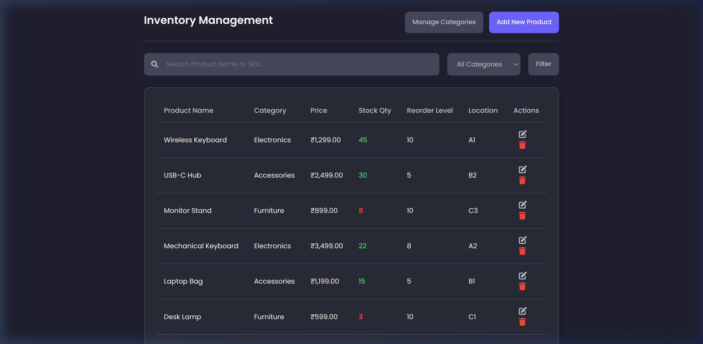
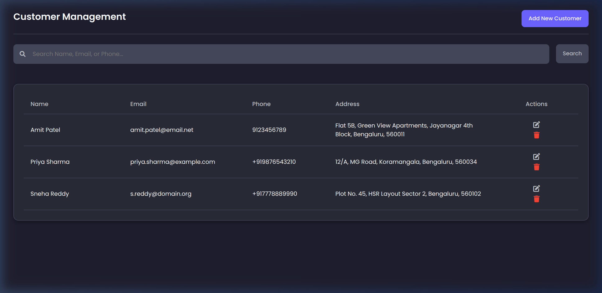
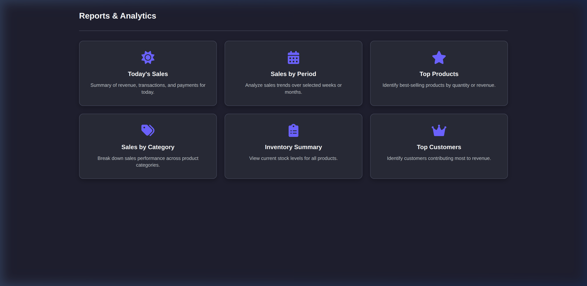
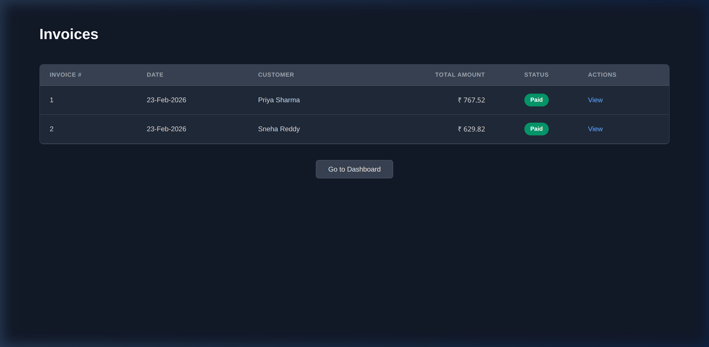
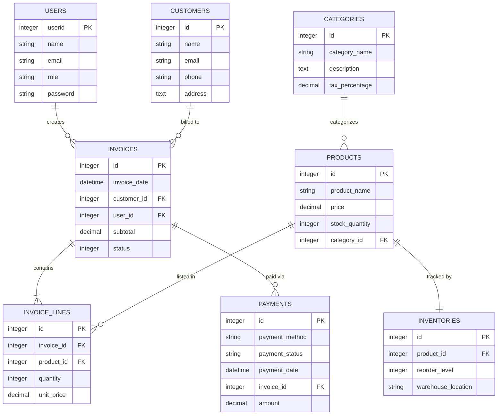

<p align="center">
  
  
  
  
  
</p>

<h1 align="center">🛒 RetailBuddy</h1>

<p align="center">
  <strong>A modern, feature-rich Point of Sale (POS) application built with Ruby on Rails.</strong><br/>
  Designed to streamline retail operations — managing sales, inventory, customers, and reporting — all from a sleek, dark-themed web interface.
</p>

---

## 📸 Application Screenshots

<details open>
<summary><strong>🔐 Login Page</strong></summary>
<br/>
<p align="center">
  
</p>
<p align="center"><em>Secure authentication with a modern dark-themed interface.</em></p>
</details>

<details open>
<summary><strong>📊 Dashboard</strong></summary>
<br/>
<p align="center">
  
</p>
<p align="center"><em>At-a-glance sales snapshot, low-stock alerts, quick actions, and core module navigation tiles.</em></p>
</details>

<details>
<summary><strong>🧾 Point of Sale (Billing)</strong></summary>
<br/>
<p align="center">
  
</p>
<p align="center"><em>Full-featured POS with product search, live bill preview, payment method selection, and invoice generation.</em></p>
</details>

<details>
<summary><strong>📦 Inventory Management</strong></summary>
<br/>
<p align="center">
  
</p>
<p align="center"><em>Track stock levels, reorder points, and warehouse locations with color-coded stock indicators.</em></p>
</details>

<details>
<summary><strong>👥 Customer Management</strong></summary>
<br/>
<p align="center">
  
</p>
<p align="center"><em>Full CRUD for customers with search across name, email, and phone.</em></p>
</details>

<details>
<summary><strong>📈 Reports & Analytics</strong></summary>
<br/>
<p align="center">
  
</p>
<p align="center"><em>Six analytics tiles: Today's Sales, Sales by Period, Top Products, Sales by Category, Inventory Summary, and Top Customers.</em></p>
</details>

<details>
<summary><strong>🧾 Invoices</strong></summary>
<br/>
<p align="center">
  
</p>
<p align="center"><em>View all generated invoices with customer info, totals, payment status, and printable views.</em></p>
</details>

---

## ✨ Features

| Module | Highlights |
|---|---|
| **🔐 Authentication** | Session-based login, role-based access (Admin / Employee), secure logout |
| **📊 Dashboard** | Sales snapshot, low-stock alerts, quick action buttons, core module tiles |
| **🧾 Point of Sale** | Product search, live bill builder, customer selection, Cash/UPI payment, auto-tax calculation |
| **📦 Inventory** | Product CRUD, category filtering, stock quantity tracking, reorder level alerts, warehouse location |
| **👥 Customers** | Customer CRUD with search, contact info, and address management |
| **📄 Invoices** | Invoice creation, line-item management, status tracking (Draft/Issued/Paid/Cancelled), printable view |
| **📈 Reports** | Today's Sales, Sales by Period (CSV export), Top Products, Sales by Category, Inventory Summary, Top Customers |
| **🏷️ Categories** | Product category management with per-category tax percentages |
| **👤 Admin Panel** | User management for administrators |

---

## 🛠️ Tech Stack

| Layer | Technology |
|---|---|
| **Backend Framework** | Ruby on Rails 7.1 |
| **Language** | Ruby 3.2 |
| **Database** | SQLite3 |
| **Frontend** | Hotwire (Turbo + Stimulus), ERB Templates |
| **CSS Framework** | TailwindCSS 3.3 |
| **Asset Pipeline** | Propshaft + Importmap |
| **Web Server** | Puma |
| **Authentication** | Custom session-based auth with `bcrypt` |
| **Pagination** | Pagy / will_paginate |

---

## 📁 Project Structure

```
RetailBuddy/
├── app/
│   ├── controllers/
│   │   ├── application_controller.rb    # Auth helpers, login guards
│   │   ├── billing_controller.rb        # POS interface
│   │   ├── categories_controller.rb     # Category CRUD
│   │   ├── customers_controller.rb      # Customer CRUD + search
│   │   ├── help_controller.rb           # Help page
│   │   ├── inventory_controller.rb      # Stock management + filtering
│   │   ├── invoices_controller.rb       # Invoice CRUD + printable view
│   │   ├── pages_controller.rb          # Login & Dashboard pages
│   │   ├── products_controller.rb       # Product CRUD + search API
│   │   ├── reports_controller.rb        # 6 analytics report actions
│   │   ├── sessions_controller.rb       # Login / Logout
│   │   └── admin/
│   │       └── users_controller.rb      # Admin user management
│   ├── models/
│   │   ├── category.rb
│   │   ├── customer.rb
│   │   ├── inventory.rb
│   │   ├── invoice.rb                   # Tax & subtotal calculations
│   │   ├── invoice_line.rb
│   │   ├── payment.rb
│   │   ├── product.rb                   # Delegates tax from category
│   │   └── user.rb                      # Role-based, session auth
│   └── views/
│       ├── billing/                     # POS interface
│       ├── categories/                  # Category management
│       ├── customers/                   # Customer management
│       ├── inventory/                   # Inventory tracking
│       ├── invoices/                    # Invoice list + printable
│       ├── pages/                       # Login + Dashboard
│       └── reports/                     # Analytics views
├── config/
│   ├── database.yml                     # SQLite3 configuration
│   └── routes.rb                        # All application routes
├── db/
│   ├── schema.rb                        # Database schema
│   └── seeds.rb                         # Sample data seeder
├── Gemfile                              # Ruby dependencies
└── Dockerfile                           # Docker deployment
```

---

## 🗄️ Database Schema



---

## 🚀 Getting Started

### Prerequisites

- **Ruby** 3.2+
- **Bundler** (`gem install bundler`)
- **Node.js** (for TailwindCSS asset compilation)

### Installation

```bash
# 1. Clone the repository
git clone https://github.com/yourusername/RetailBuddy.git
cd RetailBuddy

# 2. Install dependencies
bundle install

# 3. Set up the database
bin/rails db:create db:schema:load db:seed

# 4. Start the server
bin/rails server
```

Then open **http://localhost:3000** in your browser.

### Default Login Credentials

| Role | Email | Password |
|---|---|---|
| **Admin** | `admin@retailbuddy.com` | `password123` |
| **Employee** | `staff@retailbuddy.com` | `password123` |

---

## 🧪 Seed Data

The `db/seeds.rb` file populates the database with realistic sample data:

- **2 Users** — Admin and Staff accounts
- **3 Categories** — Electronics (18% tax), Accessories (12% tax), Furniture (5% tax)
- **6 Products** — Wireless Keyboard, USB-C Hub, Monitor Stand, Mechanical Keyboard, Laptop Bag, Desk Lamp
- **6 Inventory Records** — Warehouse locations A1–C3 with reorder levels
- **3 Customers** — With Bengaluru addresses
- **2 Invoices** — Pre-created paid invoices with line items and payments (Card & UPI)

---

## 📋 API Endpoints

| Method | Path | Description |
|---|---|---|
| `GET` | `/` | Login page |
| `POST` | `/login` | Authenticate user |
| `DELETE` | `/logout` | Destroy session |
| `GET` | `/success` | Dashboard |
| `GET` | `/billing/new` | Point of Sale interface |
| `GET` | `/inventory` | Inventory management |
| `GET/POST` | `/products` | Product CRUD |
| `GET` | `/products/search` | Product search API (JSON) |
| `GET/POST` | `/customers` | Customer CRUD |
| `GET/POST` | `/invoices` | Invoice CRUD |
| `GET` | `/invoices/:id/printable` | Printable invoice view |
| `GET/POST` | `/categories` | Category CRUD |
| `GET` | `/reports` | Reports hub |
| `GET` | `/reports/todays_sales` | Today's sales report |
| `GET` | `/reports/sales_by_period` | Sales by date range (HTML + CSV) |
| `GET` | `/reports/top_products` | Top selling products |
| `GET` | `/reports/sales_by_category` | Revenue by category |
| `GET` | `/reports/top_customers` | Top customers by revenue |
| `GET/POST` | `/admin/users` | Admin user management |
| `GET` | `/help` | Help page |

---

## 🐳 Deployment

RetailBuddy includes a `Dockerfile` and `Kamal` configuration for containerized deployment:

```bash
# Build the Docker image
docker build -t retailbuddy .

# Run the container
docker run -p 3000:3000 retailbuddy
```

---

## � Contributors

| Name | GitHub |
|---|---|
| **Mihir Sahay** | [@sahaymihir](https://github.com/sahaymihir) |
| **Rishi Khandelwal** | [@RishiK1706](https://github.com/RishiK1706) |
| **Omkar Nayak B** | [@omkar3599](https://github.com/omkar3599) |

---

## �📄 License

This project is open source and available under the [MIT License](LICENSE).

---